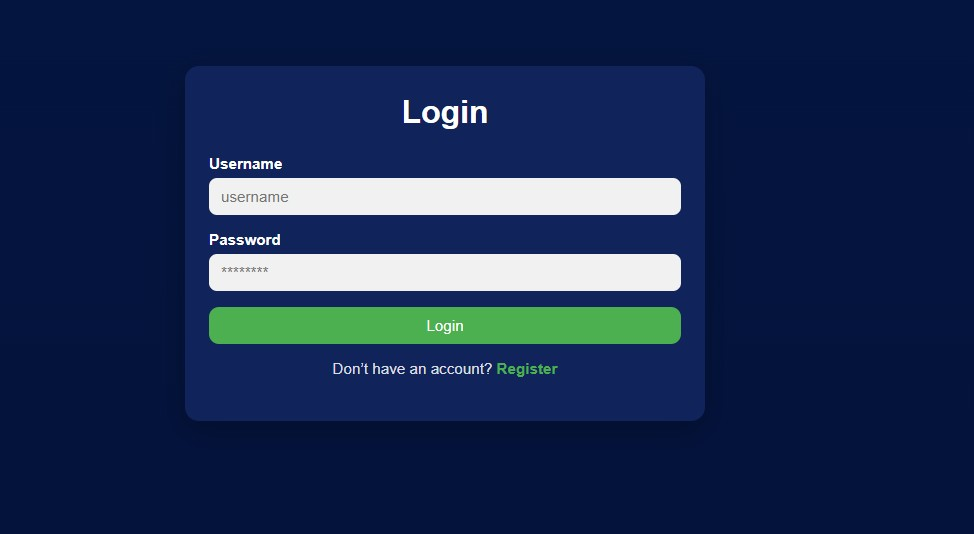
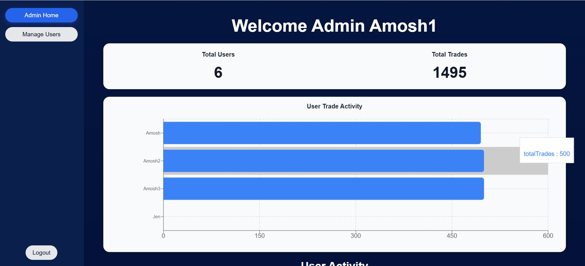

# Forex Trade Tracker

A full-stack trading journal and analytics platform for tracking forex trades, analysing trading performance, and managing trading strategies through data-driven insights.

This project is designed to help traders log trades, review strategies, and improve decision-making through structured data tracking.


## 🚀 Overview

The application consists of two main parts:

- **Client:** React frontend (UI & user interaction)
- **Server:** Node.js + Express backend (API, authentication, database)


| Login | User Dashboard | Admin Panel |
| ----- | -------------- | ----------- | 
|  |  |  |


## 🛠️ Tech Stack

### Frontend

- React 19, React Router v7
- TanStack Query v5 (data fetching & caching)
- Recharts (trade performance charts)
- Axios (HTTP client)
- jwt-decode (token handling)
- Custom modular CSS

### Backend

- Node.js + Express 5
- MongoDB + Mongoose 9
- JWT (```jsonwebtoken```) Authentication
- bcrypt for password hashing
- dotenv, nodemon, cors


## 🔐 Features List 

### User: 

- Register and log in with JWT authentication
- Log trades: symbol, direction (buy/sell), open/close price, volume, stop loss, take profit, P&L, strategy, notes
- View all trades in a paginated, filterable table (filter by symbol. direction, strategy)
- Visual P&L indicators (🟢 Profit / 🔴 Loss / ⚪ Breakeven)
- Dashboard with performance charts: win/loss breakdown, strategy usage, P&L by symbol, direction efficiency

### Admin: 

- View all registered users
- See per-user trade counts
- Delete users (and their trades)
- Update user roles
- User activity analytics

## 🏗️ Architecture
```text
Client (React + React Query)
        ↓
REST API (Express.js)
        ↓
MongoDB Database
```

## 🚀 Getting Started 

**Prerequisites:** Node.js, MongoDB (local or Atlas)

**1. Clone & install**
```bash
git clone https://github.com/yourname/forex-trade-tracker.git

# From the project root:
# Install server dependencies
cd server && npm install

# Install client dependencies
cd ../client && npm install
```

**2. Configure environment**
See [server/README.md](./server/README.md#environment-variables) for required `.env` variables.

**3. Run**
```bash
# In /server
npm run dev

# In /client
npm start
```

App runs at `http://localhost:3000`, API at `http://localhost:5000`.

## 🧩 Project Structure

```
FOREX-TRADE-TRACKER/
│
├── client/          # React SPA (see client/README.md)
├── server/          # Express API (see server/README.md)
│
└── screenshots/     # UI screenshots
```


## 🌐 Live Demo 

🚀 Try the application here:  
[https://forex-trade-tracker-opal.vercel.app](https://forex-trade-tracker-opal.vercel.app)

Frontend hosted on Vercel.  
Backend API hosted separately using Render.


## 🚧 Project Status

This project is currently in active development. The core full-stack functionality has been implemented, including authentication, trade management, filtering, pagination, analytics dashboards, chart visualizations, and admin user management.

Current improvements are focused on improving scalability, user experience, and advanced trading insights.


### Planned Improvements
- Pagination for admin user management
- Date-range filtering for trades
- Import trades from backtesting CSV
- AI-powered strategy analysis and feedback
- Additional dashboard insights and analytics
- Equity curve and performance tracking charts

## 📚 What I Learned

This project helped strengthen my understanding of:

- Full-stack application architecture
- JWT authentication flows
- React Query data management
- MongoDB aggregation pipelines
- REST API development
- Role-based authorization
- Data visualization with charts
- Backend and frontend integration

## 📘 Additional Documentation

- [Client Documentation](./client/README.md)
- [Server Documentation](./server/README.md)


---
## 👤 Author

**Author:** Amosh — [GitHub](https://github.com/Amoshb)
