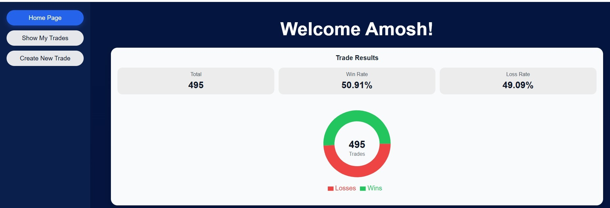
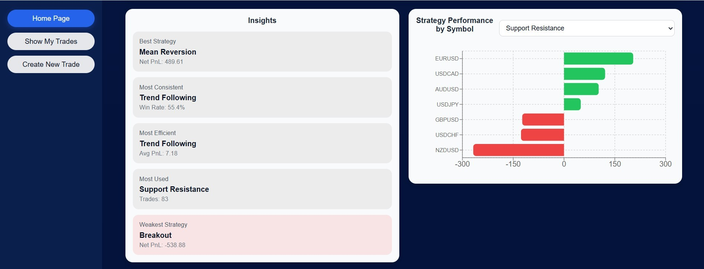
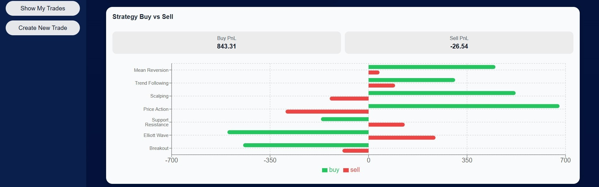
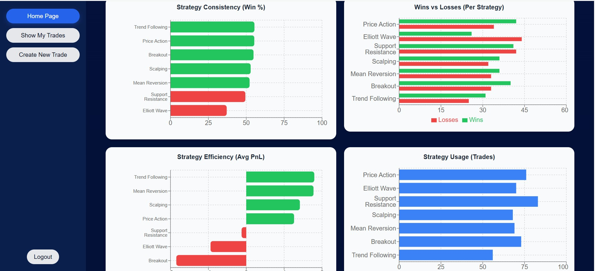
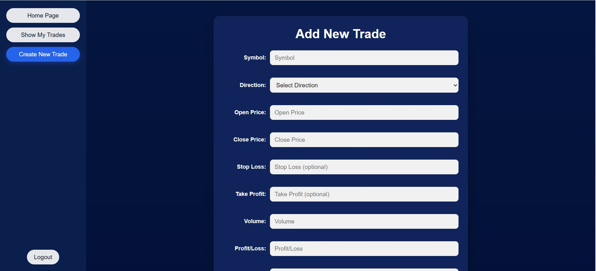
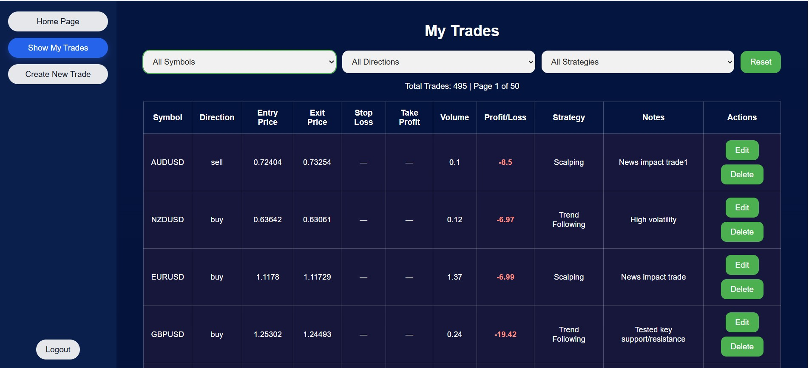

# Forex Trade Tracker (Client)

This is the React frontend for the Forex Trade Tracker application. It provides the user interface for authentication, trade management, analytics dashboards, chart visualizations, and admin management tools.

The frontend is built with React, React Router, TanStack Query, Axios, and Recharts.

## ⚙️ Setup

**Prerequisites:** Node.js 18+

**Install**

```bash
cd client
npm install
```

**Environment**
Create a `.env` file in `/client`:

```
REACT_APP_API_BASE_URL=http://localhost:5000
```

**Start**

```bash
npm start     # Development server on port 3000
```

## 🛠️ Tech Stack

- React 19
- React Router v7
- TanStack Query v5
- Axios
- Recharts
- jwt-decode
- Custom modular CSS

## 📁 Project Structure

```
src/
├── api.js          # Axios instances (authApi, publicApi) + interceptors
├── App.js          # Root: routing + role-based layout (user/admin)
│
├── pages/
│   ├── Login.jsx           # Login form
│   ├── Register.jsx        # Registration form
│   ├── UserPage.jsx        # User dashboard shell
│   └── AdminPage.jsx       # Admin dashboard shell
│
├── components/
│   ├── CreateTrade.jsx         # Trade creation form
│   ├── LoadingButton.jsx       # Reusable async button
│   │
│   ├── trades/
│   │   ├── ShowAllTrades.jsx   # Paginated + filterable trade table
│   │   ├── TradeTable.jsx      # Table wrapper
│   │   └── TradeRow.jsx        # Individual trade row with inline edit/delete
│   │
│   ├── trade_chart/
│   │   ├── UserHomepage.jsx              # Main analytics dashboard
│   │   ├── InsightPanel.jsx              # Key performance stats
│   │   ├── TradeOverviewPieChart.jsx     # Win/loss/breakeven pie
│   │   ├── StrategyWinRateChart.jsx
│   │   ├── StrategyWinLossChart.jsx
│   │   ├── StrategyUsageChart.jsx
│   │   ├── StrategyEfficiencyChart.jsx
│   │   ├── StrategyDirectionChart.jsx
│   │   ├── StrategySymbolChart.jsx
│   │   └── ChartStateWrapper.jsx         # Loading/error/empty states
│   │
│   └── admin/
│       ├── AdminHomePage.jsx
│       ├── AdminStatsCards.jsx
│       ├── AdminUserActivityChart.jsx
│       ├── AdminUserActivityTable.jsx
│       └── EditUsers.jsx
│
└── styles/
    ├── main.css       # Global stylesheet entry point
    ├── base/          # reset.css, typography.css, variables.css
    ├── components/    # Per-component CSS
    └── layout/        # app.css, dashboard.css, sidebar.css

```

## 🔐 Authentication Flow

1. User logs in → `POST /api/auth/login` → receives JWT
2. Token stored in `localStorage` as `"token"`
3. On app load, token is decoded with `jwt-decode` and checked for expiry
4. All API calls via `authApi` automatically attach `Authorization: Bearer <token>` (via Axios interceptor)
5. On 401/403 response, token is cleared and user is redirected to `/login`
6. Role (`user` | `admin`) is decoded from the token to determine which dashboard loads

---

## 📡 Data Fetching

This project uses **TanStack Query v5** for server-state management.

- `useQuery` is used for fetching trades, analytics, and admin data
- `useMutation` is used for creating, updating, and deleting trades/users
- `queryClient.invalidateQueries()` is used to refresh cached data after mutations

This setup provides:

- Automatic caching
- Background refetching
- Loading and error states
- Reduced manual `useEffect` state management
- Improved UI responsiveness and synchronization

## 🧭 Routing

| Route       | Component | Access              |
| ----------- | --------- | ------------------- |
| `/login`    | Login     | Public              |
| `/register` | Register  | Public              |
| `/*`        | UserPage  | Authenticated users |
| `/*`        | AdminPage | Admin role only     |

Unauthenticated users are redirected to `/login`. Role is determined from the JWT payload.

## 📸 Screenshots

**User Dashboard**


**Trade Charts**




**Create Trade**


**Trade History (with filters)**


---

## 👤 Author

Amosh Balami

- GitHub: https://github.com/Amoshb
